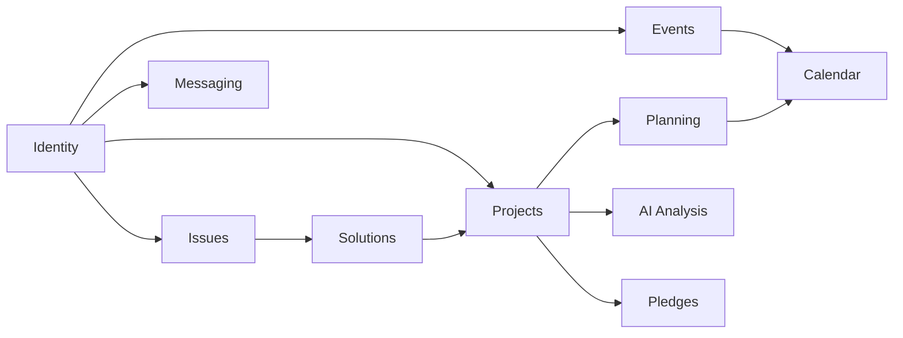

# Database schema

This document describes how the Ecowise PostgreSQL database is organised at a conceptual level.
It groups data by domain, sketches the high-level relationships, and outlines the indexing,
JSONB, and normalisation conventions used. Authoritative schema definitions and column
detail live in the source repository and are not mirrored here.

## Table of contents

- [Conventions](#conventions)
- [Domain overview](#domain-overview)
- [Identity](#identity)
- [Skills and tags](#skills-and-tags)
- [Projects](#projects)
- [Project planning](#project-planning)
- [Issues and solutions](#issues-and-solutions)
- [Events and volunteering](#events-and-volunteering)
- [Reels](#reels)
- [Messaging](#messaging)
- [Infrastructure](#infrastructure)
- [Indexing strategy](#indexing-strategy)
- [JSONB usage](#jsonb-usage)
- [Normalisation notes](#normalisation-notes)
- [Related documentation](#related-documentation)

## Conventions

All entities use surrogate primary keys. Every entity carries created and updated timestamps.
Soft-delete is preferred over physical removal. Lookup tables hold human-readable codes that
the parent rows reference by foreign key, never inline. Optimistic concurrency uses a row
version column on the most-edited families.

## Domain overview

The platform organises its data around a central identity layer, a collaboration loop that
flows from issues through solutions into projects, a planning surface inside each project, an
events surface for community engagement, and a messaging surface that cross-cuts everything.

## Identity

Every user has one canonical identity record and exactly one role-specific profile (individual,
organisation, or government). On top of the base type, dynamic role grants — Investor most
notably — are stored separately so they can be granted and revoked without touching the
base identity. Email verification and password reset use short-lived one-time passcodes.

## Skills and tags

The platform maintains a curated skill catalogue that is shared across the signup wizard, the
project required-skills picker, and the matcher. Sustainability sectors and project lifecycle
stages are similar small lookup catalogues. Free-form tags allow ad-hoc grouping of projects
and events.

## Projects

The project family covers the project record itself plus auxiliary tables for funding interest,
impact evidence, AI analysis history (with insights and SDG mapping), pairwise comparison
history (with metric and insight rows), and matcher results.

## Project planning

The planning subdomain models a tree of nodes anchored to a project. Sections and tasks share
a common node row that holds parent, ordering, and row-version fields. Section-specific and
task-specific tables hold the fields unique to each kind. Tasks reference assignees, status,
due dates, and durations.

## Issues and solutions

Government-issued sustainability challenges, the solutions organisations propose against them,
the upvotes individuals give to solutions, and the contributor-interest registrations from
individuals all live in this subdomain. A separate matcher-results table holds candidate
solver rankings.

## Events and volunteering

Event posts are content rows with status, host, and lifecycle metadata. Per-event registration
rows hold the state machine for each attendee or volunteer. Reactions, comments, media, and
tag mappings hang off the event post. A matcher-results table holds candidate volunteer
rankings.

## Messaging

Conversations and messages are simple: a conversation header carries type and lifecycle, a
participant row exists per member with a per-user read marker for unread counts, and messages
form an ordered stream within a conversation.

## Infrastructure

Cross-cutting infrastructure includes a global status lookup used by many domains and an
append-only audit log that records sensitive admin and lifecycle transitions.

## Indexing strategy

The platform indexes for the read patterns the clients actually use. Unique constraints back
identity lookups; foreign-key columns are indexed where the parent is queried by id; composite
indexes back the hottest list endpoints; and matcher-result tables index by entity and score
so top-N reads are index-only.

## JSONB usage

JSONB is used sparingly and only where the shape is open-ended or rapidly evolving. AI-derived
insights and per-dimension match breakdowns are kept as JSONB so the LLM contract can change
without a migration. All other shapes are normalised into typed columns.

## Normalisation notes

The schema targets third normal form. The user identity supertype/subtype split keeps the
master user table free of nullable per-role columns; lookup tables centralise human-readable
codes; n:m relationships always use a join table.

## Related documentation

- [api-endpoints.md](api-endpoints.md)
- [code-structure.md](code-structure.md)
- [security.md](security.md)
- [Back to index](README.md)
