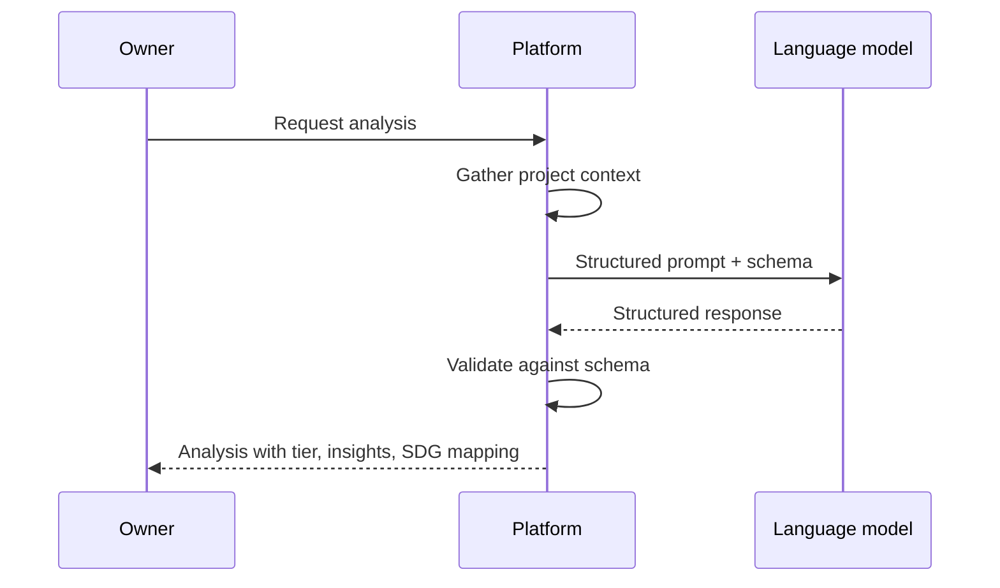
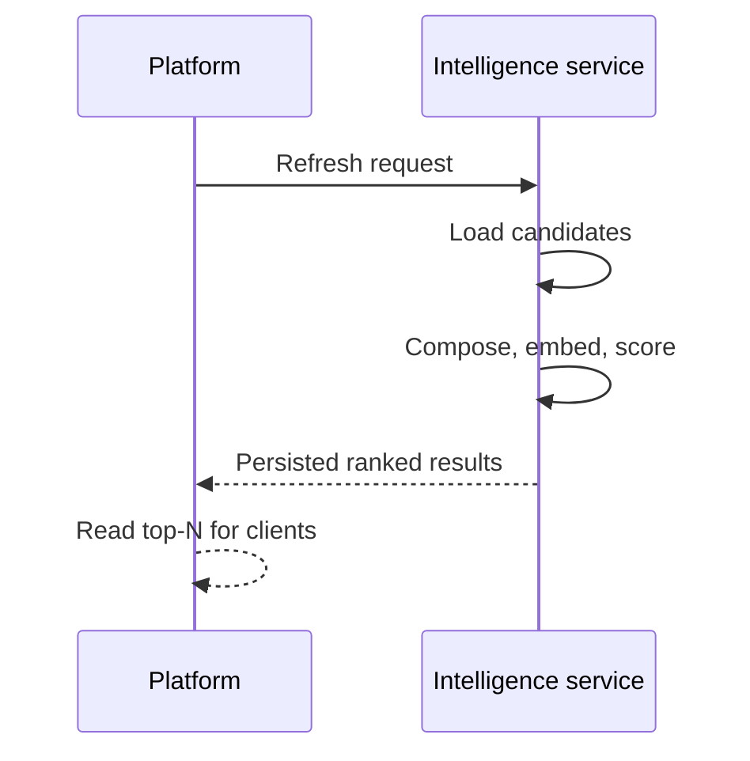
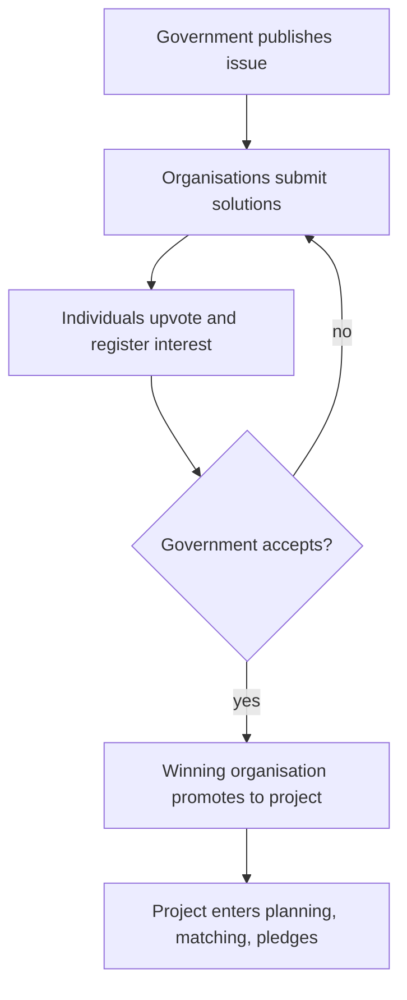
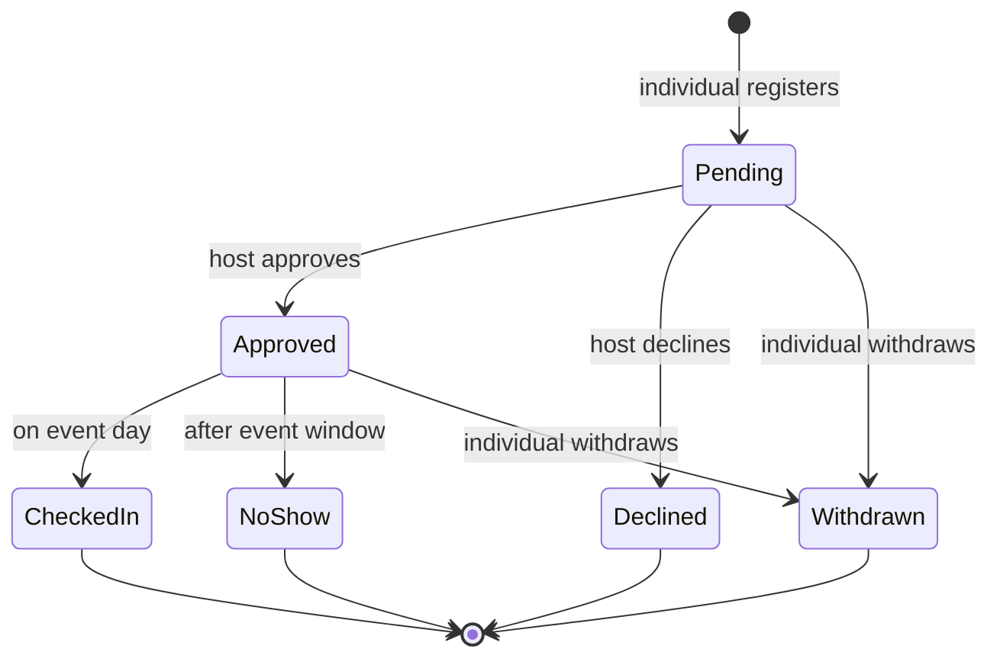

# UML diagrams

This document collects conceptual diagrams for the most important flows and lifecycles on the
platform. Diagrams use Mermaid so GitHub renders them inline. The diagrams describe behaviour
at a feature level — they are not derived from the source code structure.

## Table of contents

- [Investor pledge submission](#investor-pledge-submission)
- [AI project analysis pipeline](#ai-project-analysis-pipeline)
- [Matcher load and re-rank](#matcher-load-and-re-rank)
- [Issue → solution → acceptance → promotion](#issue--solution--acceptance--promotion)
- [Event registration lifecycle](#event-registration-lifecycle)
- [Related documentation](#related-documentation)

## Investor pledge submission

```mermaid
sequenceDiagram
  participant Investor
  participant Client as Web/Mobile
  participant Platform
  Investor->>Client: Open project, choose Pledge
  Client->>Platform: Submit pledge
  Platform-->>Client: Pledge created, status pending
  Client-->>Investor: Confirmation; visible in pledge inbox
```

## AI project analysis pipeline



## Matcher load and re-rank



## Issue → solution → acceptance → promotion



## Event registration lifecycle



## Related documentation

- [use-cases.md](use-cases.md)
- [database-schema.md](database-schema.md)
- [modules/project-planning.md](modules/project-planning.md)
- [Back to index](README.md)
