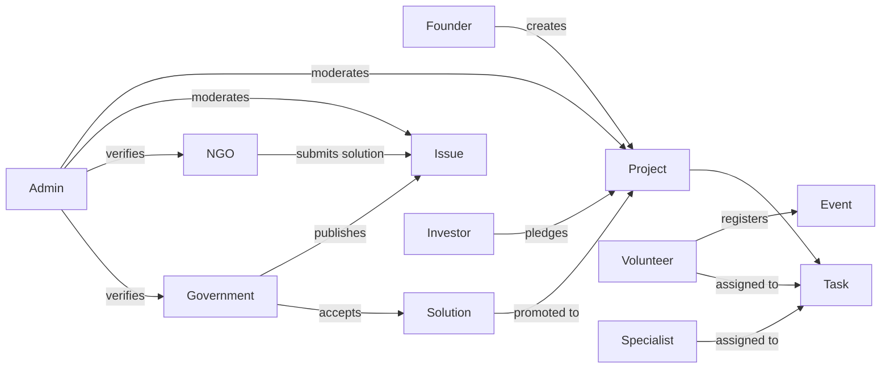

# Use cases

This document captures the primary use cases on Ecowise organised by actor. Each section
describes what an actor does on the platform, the typical flow, and where it can deviate.

## Table of contents

- [Actors](#actors)
- [Founder use cases](#founder-use-cases)
- [NGO use cases](#ngo-use-cases)
- [Government use cases](#government-use-cases)
- [Investor use cases](#investor-use-cases)
- [Volunteer use cases](#volunteer-use-cases)
- [Specialist use cases](#specialist-use-cases)
- [Administrator use cases](#administrator-use-cases)
- [Use case diagram](#use-case-diagram)
- [Related documentation](#related-documentation)

## Actors

| Actor | Account type | Primary goal |
| --- | --- | --- |
| Founder | Individual / Organisation | Launch and grow a sustainability project. |
| NGO | Organisation | Run programmes; respond to government issues. |
| Government | Government | Publish sustainability challenges; report outcomes. |
| Investor | Any (with Investor role) | Discover and back promising projects. |
| Volunteer | Individual | Contribute time to projects and events. |
| Specialist | Individual | Lend expertise to specific tasks. |
| Administrator | Admin | Keep the platform healthy. |

## Founder use cases

- Sign up, verify email, complete profile.
- Create a project (manually or via the AI generator).
- Build out the plan, attach required skills, request collaborators.
- Open the project to pledges and review the inbox.
- Watch the recommendations feed for matched volunteers.

## NGO use cases

- Maintain the organisation profile and verification.
- Browse open government issues and submit solutions.
- Run the project portfolio: status, pledges, plan execution.
- Publish events to drive volunteer turnout.

## Government use cases

- Publish a sustainability issue describing a need.
- Watch incoming solutions and contributor interest.
- Accept the winning solution.
- Generate the periodic sustainability report.

## Investor use cases

- Enable the Investor role.
- Compare candidate projects side-by-side.
- Place a pledge; withdraw or upgrade as circumstances change.
- Track pledge status from the investor dashboard.

## Volunteer use cases

- Browse the events feed; register for events of interest.
- Upvote solutions and offer to contribute.
- Pick up tasks assigned in projects they have joined.

## Specialist use cases

- Same surfaces as Volunteer plus richer skill tagging.
- Get pulled into the assignee recommender for tasks needing specific skills.

## Administrator use cases

- Triage the verification queue.
- Sweep moderation queues; act on flagged content.
- Create on behalf of users when bootstrapping accounts.
- Watch the platform brief and KPI dashboard.

## Use case diagram

## Related documentation

- [user-manual.md](user-manual.md)
- [uml-diagrams.md](uml-diagrams.md)
- [requirements.md](requirements.md)
- [Back to index](README.md)
